### Métricas de entrenamiento

#### Modelo entrenado con RGB con crossentropy (New RGB)

Las métricas de pérdida (loss) y precisión (accuracy) son las métricas más conocidas y utilizadas para evaluar modelo.

loss: mide la diferencia entre la segmentación predicha por el modelo y la segmentación real. Un valor bajo de loss indica que la predicción del modelo es cercana a la segmentación real.
Se puede ver como el valor de loss va disminuyendo por cada epoch
llegando a estar muy cerca de 0.2. Aunque esto aun se podría considerar un valor de loss alto.

accuracy: mide la fracción de píxeles correctamente clasificados por el modelo. Un valor alto de accuracy indicaría que el modelo está segmentando correctamente los árboles.

Ocurre que tanto para todo el entrenamiento como para la validaciónel valor del accuracy se mantiene en el mmismo rango sin sufrir aumentos o disminuciones significativas, esto se puede deber a que la métrica accuracy puede ser engañosa si la proporción de píxeles que pertenecen a árboles es muy diferente a la proporción de píxeles que no pertenecen a árboles. En este caso, es mejor utilizar otras métricas, como la sensibilidad (recall) y la especificidad (specificity), para evaluar el rendimiento del modelo. Como se verán a continuación.

La métrica de precisión binaria (binary accuracy) mide la fracción de píxeles correctamente clasificados como árboles o no árboles, es decir, la proporción de verdaderos positivos y verdaderos negativos en relación con el total de píxeles. Un valor alto de binary accuracy indica que el modelo está segmentando correctamente los árboles y los píxeles que no pertenecen a un árbol.

Aquí se aprecia que sus valores en comparación con los de accuracy son practicamente idénticos por lo cual tienen el mismo comportamiento que resulta poco fiable.

Es importante analizar la binary accuracy en conjunto con otras métricas, como la sensibilidad (recall) y la especificidad (specificity), para evaluar el rendimiento del modelo en la segmentación de árboles. 

La sensibilidad mide la capacidad del modelo para detectar los píxeles que pertenecen a un árbol. Los verdaderos positivos.

La especificidad mide la capacidad del modelo para detectar los píxeles que no pertenecen a un árbol. Los verdaderos negativos.

La especificidad es 0 y la sensibilidad es en todo momento menor que 0.2 lo que indica que no está identificando correctamente los píxeles que no pertenecen a un árbol y que está segmentando erróneamente áreas que no son árboles. Además, una sensibilidad menor que 0.2 indica que el modelo está detectando muy pocos de los píxeles que pertenecen a un árbol, lo que significa que está segmentando incorrectamente la mayoría de los árboles.

Coeficiente de Dice (Dice Coefficient): Esta métrica mide la similitud entre las segmentaciones generadas por el modelo y las segmentaciones reales. El coeficiente de Dice oscila entre 0 y 1, donde 0 indica una falta total de superposición entre las segmentaciones y 1 indica una superposición completa entre las segmentaciones. Un valor alto del coeficiente de Dice indica una buena superposición entre las segmentaciones del modelo y las segmentaciones reales, lo que significa que el modelo está segmentando correctamente los árboles.

Se ven bajos valores de esta métrica pero con el paso del entrenamiento aumenta y eso es una buena señal, es probable que con más epoch se mejore esta métrica.

El coeficiente de Jaccard (jacc-coef) se utiliza para evaluar la superposición entre la segmentación predicha por el modelo y la segmentación real.

La métrica de pérdida de Jaccard (jacc-Loss) es una función de pérdida que se utiliza en la segmentación de imágenes para entrenar modelos de manera que se maximice el coeficiente de Jaccard. La Jaccard Loss se calcula como la diferencia entre el índice de Jaccard y 1, y su valor objetivo es minimizar la pérdida para que el valor del índice de Jaccard sea lo más cercano posible a 1.

El modelo tiene un valor alto en la métrica de pérdida Jaccard Loss y un valor bajo en la métrica de evaluación Coeficiente de Jaccard, esto indica que el model oestá obteniendo una baja similitud entre la segmentación predicha y la segmentación real, lo que significa que el modelo está haciendo muchas predicciones incorrectas.

Pero se puede apreciar que a partir de 60 epochs se ve un significativo aumento de jacc-coef y disminución de jacc-loss lo que indica que va mejorando el aprendizaje del modelo, por lo que es probable que con más epoch se mejore esta métrica, al igual que si se contara con un mayor conjunto de entrenamiento.

Aunque la mayoría de estas métricas son desfavorables pero dice-coef y jacc-coef que son métricas bastante similares indican que el modelo puede ser mejorado ejecutando más epoch o contando con un mayor conjunto de datos de entrenamiento.

<!-- #### Modelo entrenado con RGB con crossentropy (New RGB)
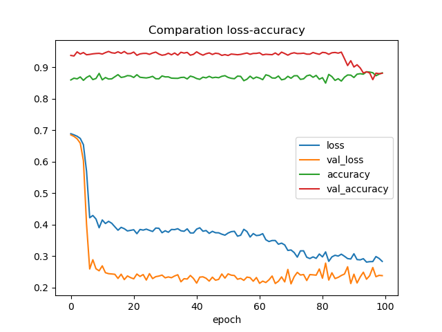
Semejante comportamiento al modelo anterior.
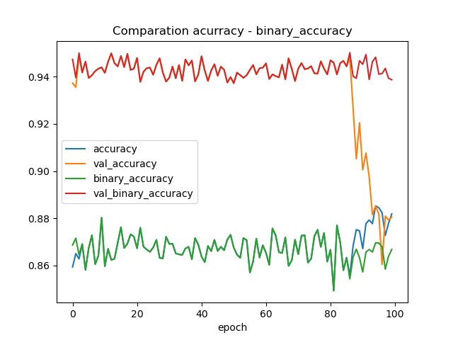
Semejante comportamiento al modelo anterior.
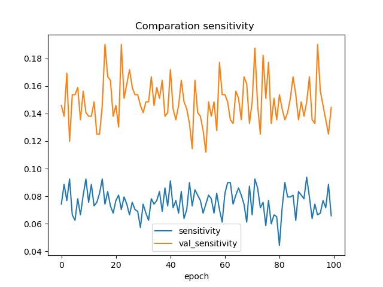
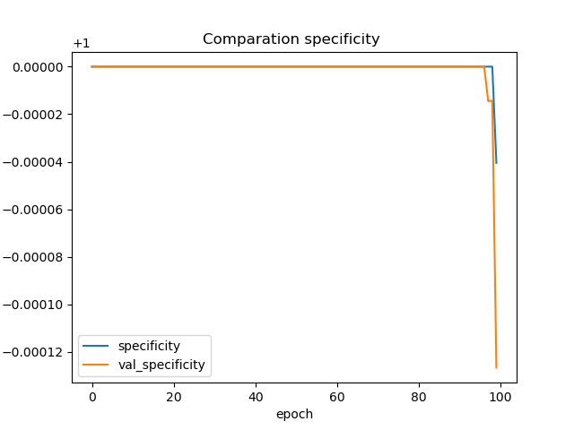

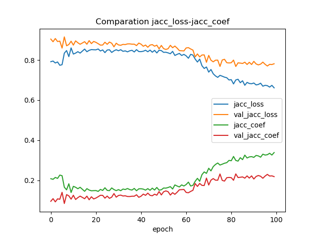 -->

#### Modelo entrenado con RGB y Nir con crossentropy (New Nir)
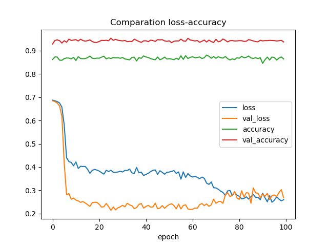
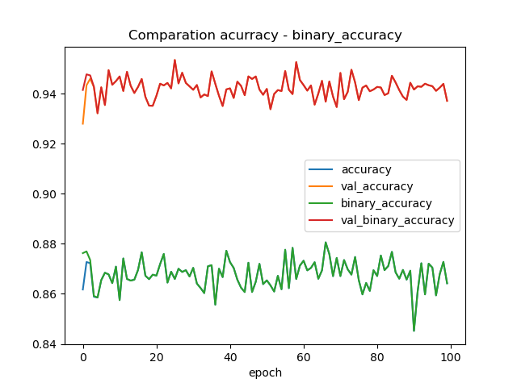
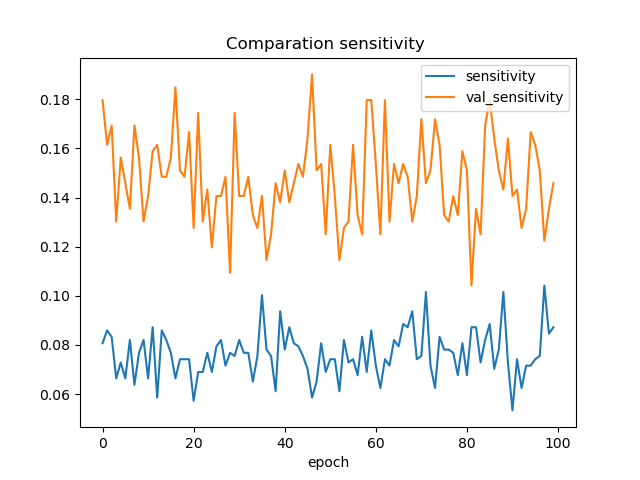
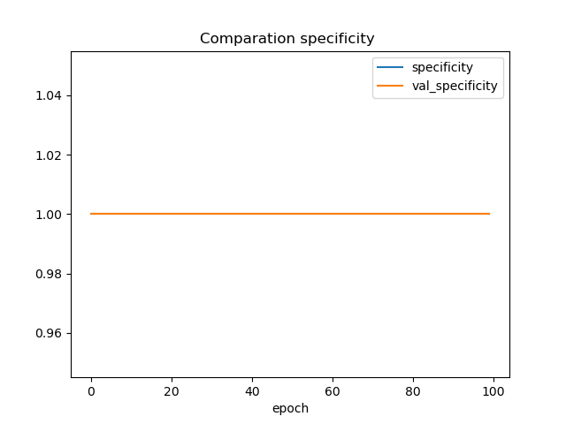
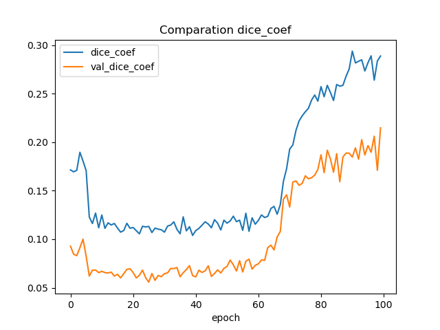
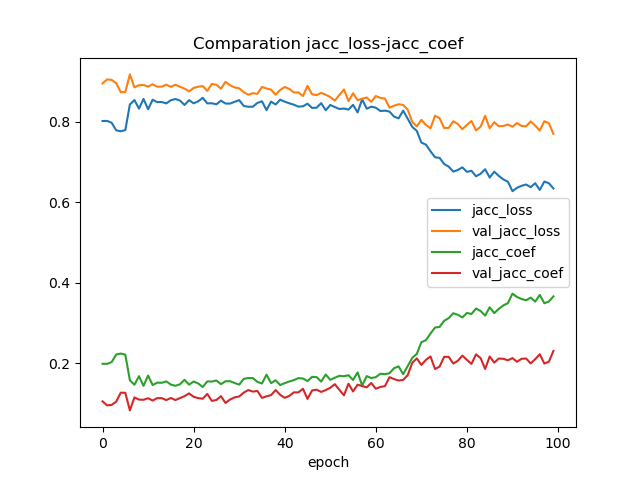

En este caso las métricas tienen un compoortamiento similar al modelo anterior, pero se puede ver que los resultados obtenidos son mejores, esto se nota en la gráfica de especificidad (specificity) porque en el modelo anterior se encontraba en 0 y en este se encuentra en 1 lo que significa que el modelo es bueno para identificar los verdaderos negativos pero no tan bueno para identificar los verdderos positivos. Igualmente se obtienen mejores valores en los coeficientes de dice y de jaccard, demostrando que es importante tener en cuenta las bandas nir a la hora de segmentar árboles.

#### Modelo entrenado con RGB con jacc (First Jacc)
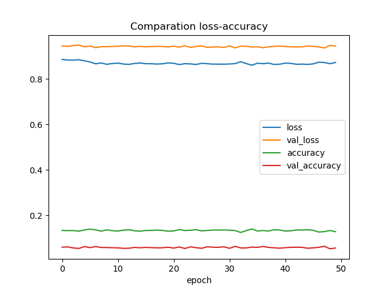
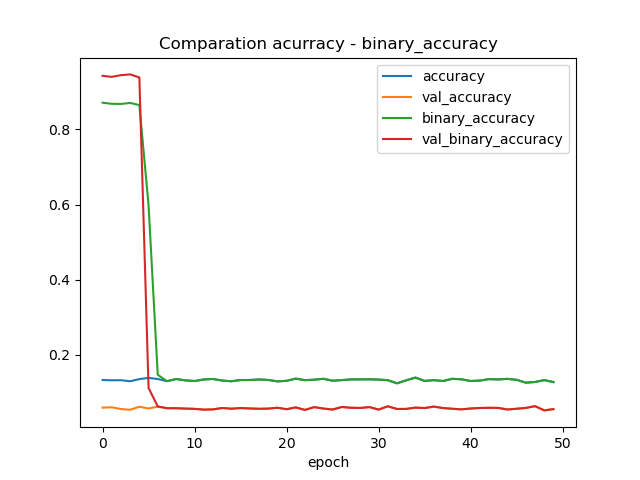
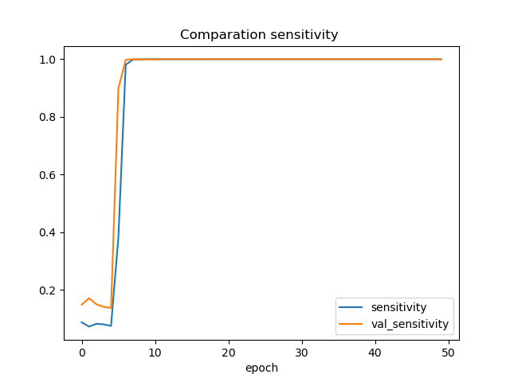
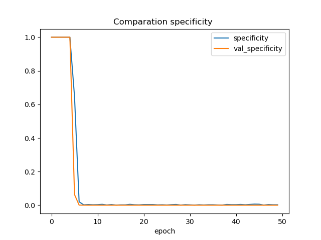
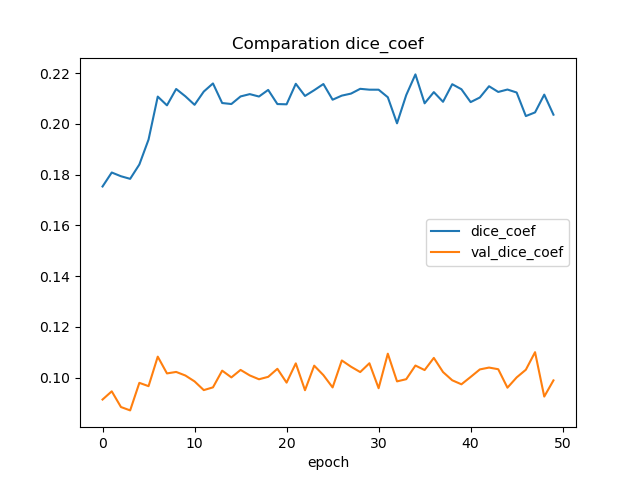
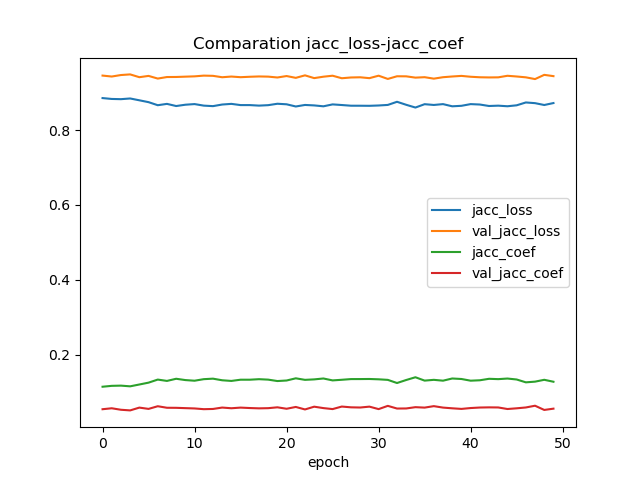

Este modelo obtiene valores muy desfavorables para todas las métricas excepto ppara la sensibilidad, esto se puede deber a que hace predicciones con gran error y que este error está en los pixeles que no pertenecen a árboles, dando una gran cantidad de falsos positivos.

#### Modelo entrenado con RGB y Nir con jacc modificado (New Jacc)

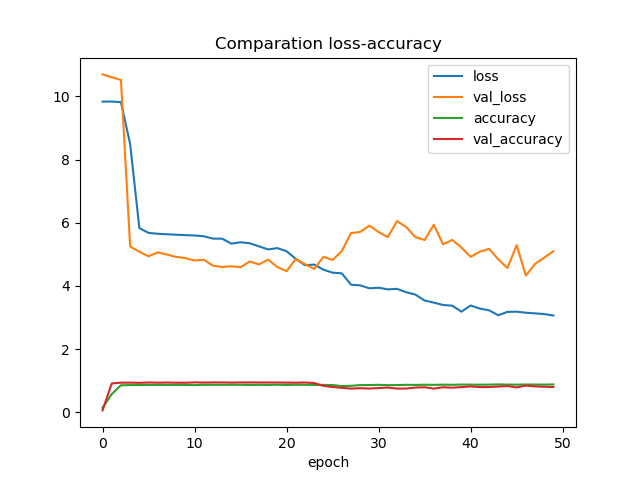
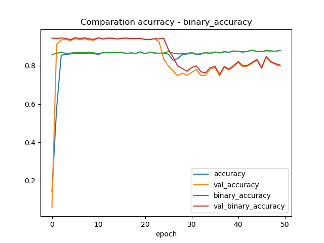
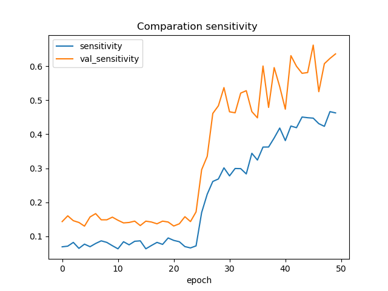
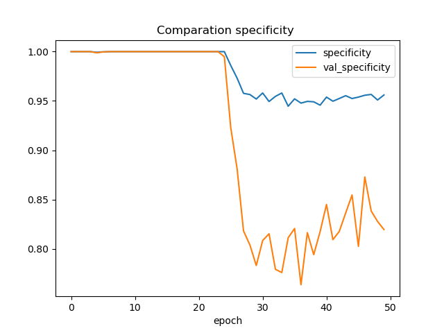
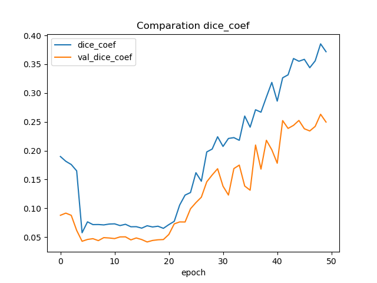
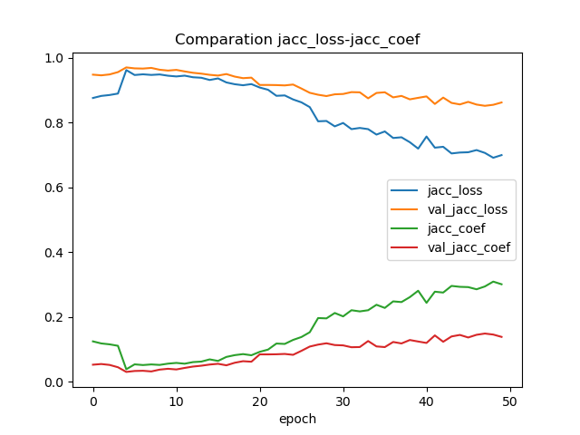

Este modelo obtiene bajos valores de loss y altos valores de accurracy y binary accuracy, también obtienen muy buenos valores de sensibilidad y especificidad, por lo que estamos en presencia del mejor modelo hasta el momento, los coeficientes de dice y de jacc dan valores similarea a los anteriores, que aunque no son los mejores tampoco se puede decir que sean malos. 

#### Modelo entrenado con RGB con jacc modificado (New Jacc Nir)

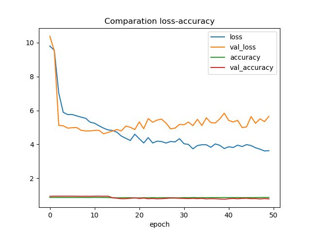
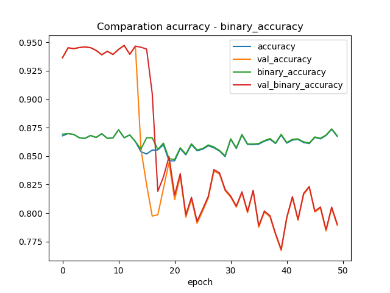
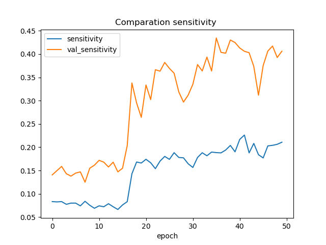
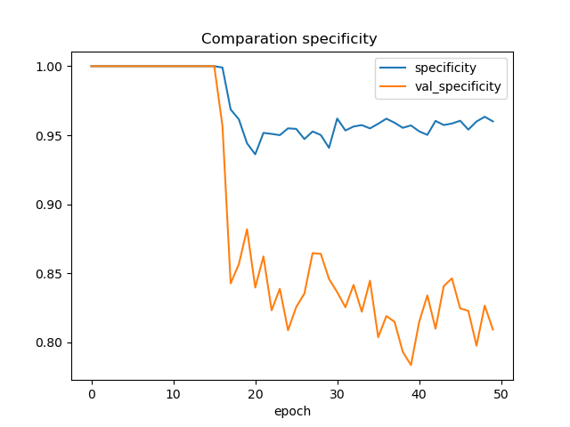
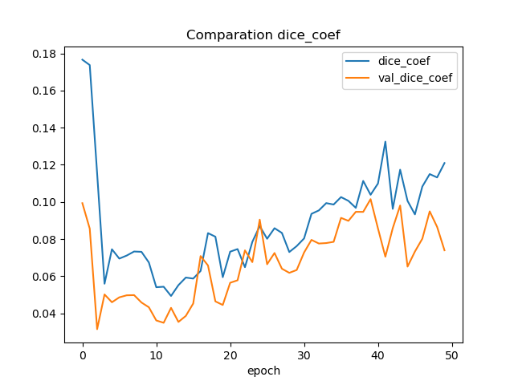
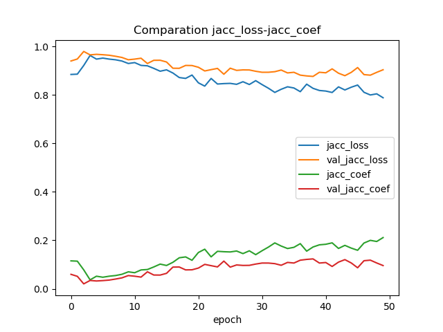

Este modeo vuelve a tener una mala evaluación, tiene un loss alto y el accuracy aunque no es malo va disminuyendo con el paso de los epoch 
al igual que ocurre con casi todas las métricas, mantiene buena sensibilidad y el coeficiente de jaccard aunque no disminuye mantiene valores muy bajos, este modelo tampoco obtuvo buenos resultados.

